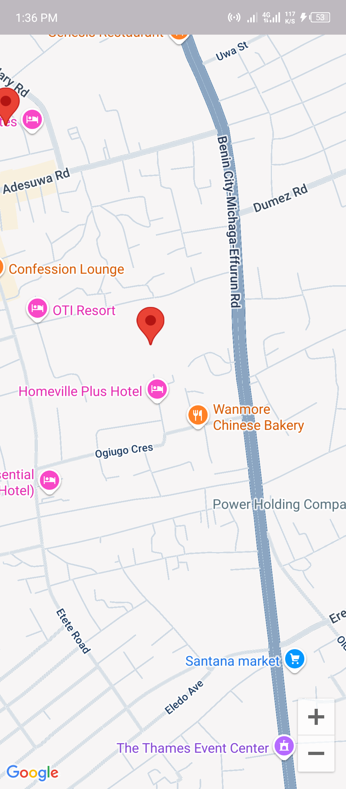
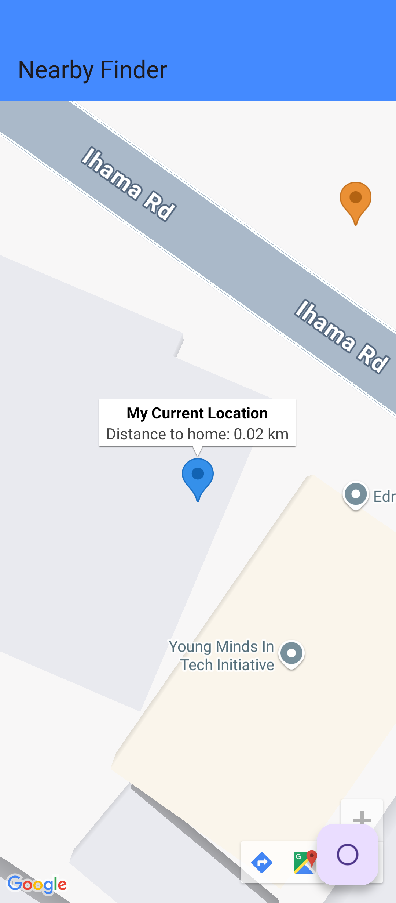
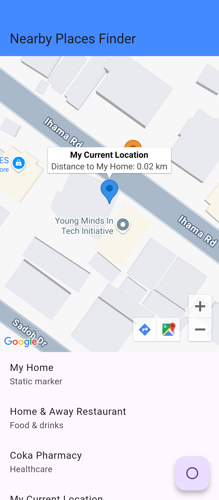
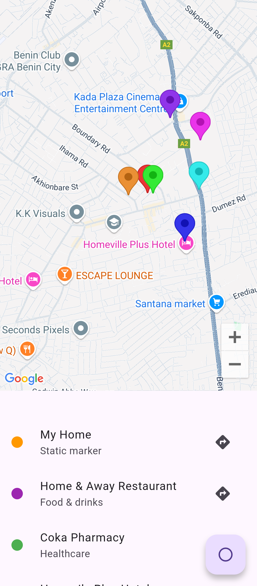
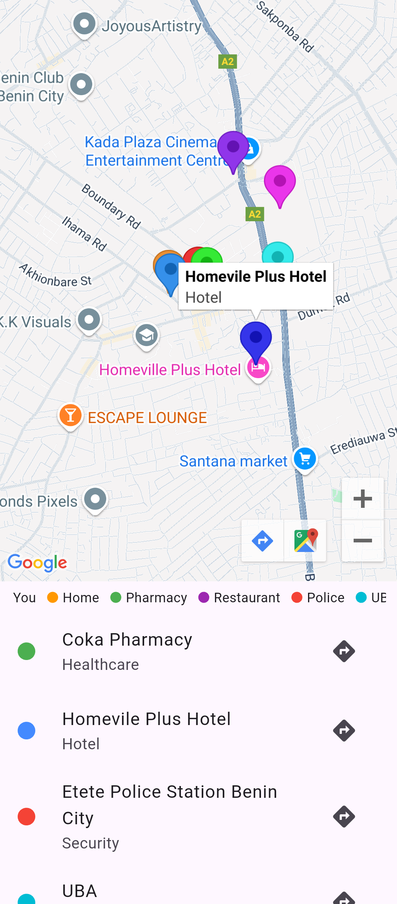

# Nearby Places Finder (google_maps_app)

[](https://flutter.dev)
[](LICENSE)
[]

A Flutter app that shows your **current location** and nearby points of interest on Google Maps.  
It auto-updates your position, shows a blue marker for the user and red markers for places, and includes a refresh button and draggable bottom sheet for place details.

> 📱 **Note:** Currently optimized for **Android only**. iOS support is planned (see Roadmap).

---

## ✨ Features
- 📍 **Auto location** on startup (high accuracy)
- 🔄 **Manual refresh** (FloatingActionButton)
- 🗺️ **Google Maps integration** with custom markers
- 📌 **Blue user marker**, red static markers for POIs
- 📊 **Draggable bottom sheet** with place details and navigation button
- 🔒 Minimal surface-level logs; no secrets in repo (see notes)

---

## 📸 Screenshots
<p align="center">
  
  
  
  
  
  
</p>


---

## 🚀 Quick Start (Android)

### Prerequisites
- [Flutter SDK](https://docs.flutter.dev/get-started/install) installed
- Android Studio or VS Code with Flutter & Dart plugins
- A Google Cloud API key with **Maps SDK for Android** (restrict the key to your Android package for safety)

### Install & Run
```bash
git clone https://github.com/lanre4444/google_maps_app.git
cd google_maps_app
flutter pub get
# add your API key to android/app/src/main/AndroidManifest.xml (see below)
flutter run
